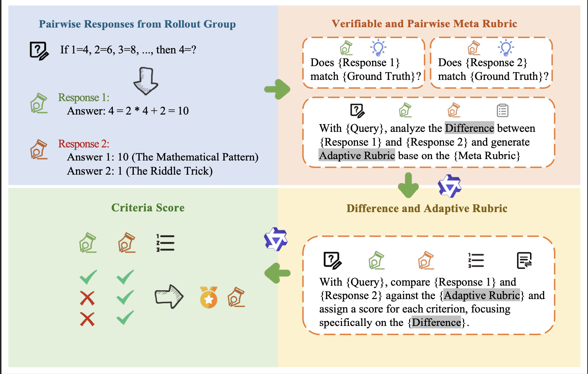
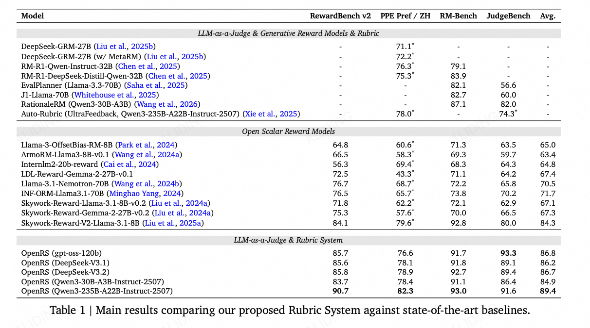

<p align="center">
  <h1 align="center">OpenRS: Open Rubric System</h1>
  <p align="center">
    <em>Replacing Reward Models with Adaptive, Fine-Grained LLM Evaluation</em>
  </p>
</p>

<p align="center">
  <a href="https://github.com/WyxBUPT-22/OpenRS"></a>
  <a href="#"></a>
  <a href="LICENSE"></a>
  <a href="README_zh.md"></a>
</p>

---

## Introduction

**OpenRS** (Open Rubric System) is an LLM-as-a-Judge evaluation framework that replaces traditional Reward Models with adaptive, fine-grained rubric-based evaluation. The core idea is to use large language models to evaluate response quality through **adaptive, query-type-specific rubrics** — enabling multi-dimensional scoring with interpretable verdicts.

The framework supports three evaluation paradigms:

| Paradigm | Scenario | Description |
| :---: | :--- | :--- |
| **Pairwise** | Chat, Code, Safety, etc. | A/B bi-directional comparison with weighted multi-criteria scoring |
| **Verifiable** | Math, Factuality | Ground-truth verification first, fallback to Pairwise if inconclusive |
| **Precise IF** | Instruction Following | Hard constraint checking, fallback to Pairwise on ties |

<p align="center">
  
  <br/>
  <em>Figure 1: OpenRS Evaluation Pipeline — From pairwise responses, through verifiable and adaptive rubric generation, to multi-criteria scoring.</em>
</p>

## Key Features

- 🎯 **Open Rubric**: 50+ query-type-specific rubrics with weighted criteria (critical / core / important / highlight)
- ⚖️ **Bi-directional Debiasing**: Swaps A/B order to eliminate position bias
- 🔍 **Critical Flaw Veto**: Fatal errors override all other scoring dimensions
- 📊 **4 Benchmarks**: [JudgeBench](https://arxiv.org/abs/2410.12784), [PPE](https://arxiv.org/abs/2410.14872), [RewardBench V2](https://arxiv.org/abs/2506.01937), [RMBench](https://arxiv.org/abs/2410.16184)


## Main Results

We evaluate five judge models across four benchmarks:

<p align="center">
  
  <br/>
  <em>Table 1: Accuracy (%) of different judge models across four benchmarks.</em>
</p>

## Installation

```bash
git clone https://github.com/WyxBUPT-22/OpenRS.git
cd OpenRS
pip install -r requirements.txt
```

**Dependencies**: `openai`, `tenacity`, `json5`, `json-repair`, `tqdm`

## Quick Start

### 1. Configure API

OpenRS is compatible with any OpenAI-compatible inference backend (vLLM, SGLang, Ollama, etc.):

```bash
export OPENAI_BASE_URL="http://localhost:8000/v1"
export OPENAI_API_KEY="your-api-key"
export OPENAI_MODEL_NAME="your-model-name"
```

### 2. Run Evaluation

<details>
<summary><b>JudgeBench / PPE</b></summary>

```bash
python judgebench_and_ppe.py \
    --input data/judgebench/gpt.jsonl \
    --output-dir results/judgebench \
    --annotation judgebench_gpt \
    --workers 50
```

</details>

<details>
<summary><b>RewardBench V2</b></summary>

```bash
python rewardbench_v2.py \
    --input data/rewardbench_v2/rewardbench_v2.jsonl \
    --output-dir results/rewardbench_v2 \
    --annotation rbv2 \
    --workers 10
```

</details>

<details>
<summary><b>RMBench</b></summary>

```bash
python rmbench.py \
    --input data/rmbench/rmbench.jsonl \
    --output results/rmbench_results.jsonl \
    --workers 10
```

</details>

### Common Arguments

| Argument | Description | Default |
| :--- | :--- | :---: |
| `--input` | Input data path | *required* |
| `--output-dir` | Output directory | `./results` |
| `--workers` | Concurrent threads | 10–50 |
| `--temperature` | Generation temperature | 0.0 |
| `--limit` | Max items to process (0=all) | 0 |
| `--no-resume` | Disable checkpoint resume | False |
| `--stats-only` | Report stats without running | False |

## Evaluation Pipeline

```
Input Data → Evaluation Router → Model Call → Score Parsing → Result Aggregation → Report
```

### Scoring Mechanism

Each criterion is weighted by importance:

| Category | Weight | Description |
| :---: | :---: | :--- |
| **Critical Flaw** | Veto | Fatal errors → immediate verdict, all other scores ignored |
| **Core** | ×5 | Key quality dimensions |
| **Important** | ×2 | Meaningful but non-critical factors |
| **Highlight** | ×1 | Bonus items |

### Dataset-Specific Logic

- **JudgeBench / PPE**: Full `evaluate_pair` per sample — Verifiable check → bi-directional Pairwise
- **RewardBench V2**: 1-vs-N comparison, subset-specific routing (Chat, Math, Safety, Precise IF, Focus); ties excluded from accuracy
- **RMBench**: 9 pairs (3 chosen × 3 rejected variants) × 2 orders = 18 evaluations per sample; stratified by Easy / Normal / Hard

## Project Structure

```
OpenRS/
├── tools.py                    # API calls, JSON parsing, file I/O
├── evaluator.py                # Core evaluation interface (evaluate_pair)
├── evaluator_precise_if.py     # Precise IF (Instruction Following) evaluator
├── robust_utils.py             # Robustness utilities (Unicode/JSON tolerance)
│
├── judgebench_and_ppe.py       # JudgeBench / PPE evaluation script
├── rewardbench_v2.py           # RewardBench V2 evaluation script
├── rmbench.py                  # RMBench evaluation script
│
├── prompts/
│   ├── pairwise_prompts/       # 50+ category-specific pairwise rubrics (.md)
│   ├── pointwise_prompts/      # Precise IF prompts
│   └── verifiable_prompts/     # Ground-truth verification prompts
│
├── data/                       # Evaluation datasets
│   ├── judgebench/
│   ├── ppe/
│   ├── rewardbench_v2/
│   └── rmbench/
│
├── requirements.txt
└── LICENSE                     # Apache License 2.0
```

## Output Format

After evaluation, results are organized by verdict:

```
results/
├── all_results_{annotation}.jsonl            # All results
├── verifiable_good_cases_{annotation}.jsonl   # Verifiable: chosen wins
├── verifiable_bad_cases_{annotation}.jsonl    # Verifiable: rejected wins
├── pairwise_good_cases_{annotation}.jsonl     # Pairwise: chosen wins
├── pairwise_bad_cases_{annotation}.jsonl      # Pairwise: rejected wins
├── pairwise_same_cases_{annotation}.jsonl     # Pairwise: tie
├── error_cases_{annotation}.jsonl             # Evaluation errors
└── summary_{annotation}.json                  # Aggregated statistics
```

## Citation

If you find this work useful, please cite:

```bibtex
@misc{openrs2025,
  title   = {Open Rubric System: Scaling Reinforcement Learning with Pairwise Adaptive Rubric},
  year    = {2025},
  url     = {https://github.com/WyxBUPT-22/OpenRS}
}
```

## License

This project is licensed under the [Apache License 2.0](LICENSE).
